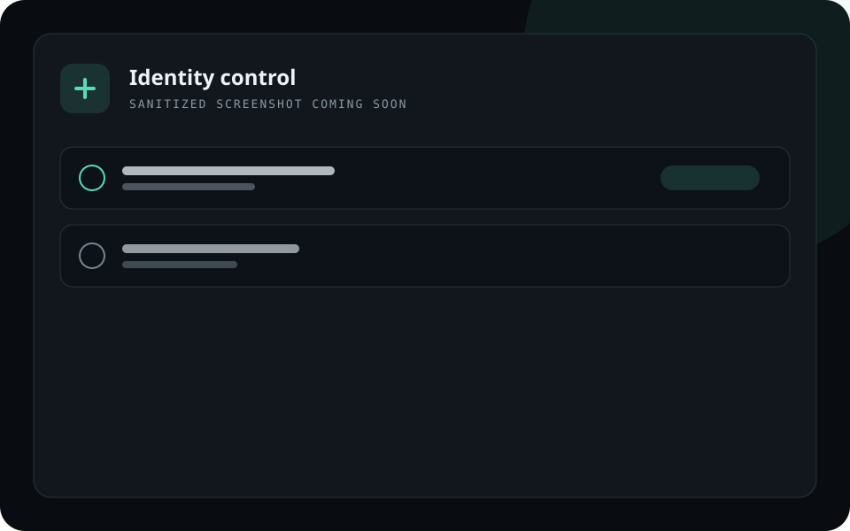
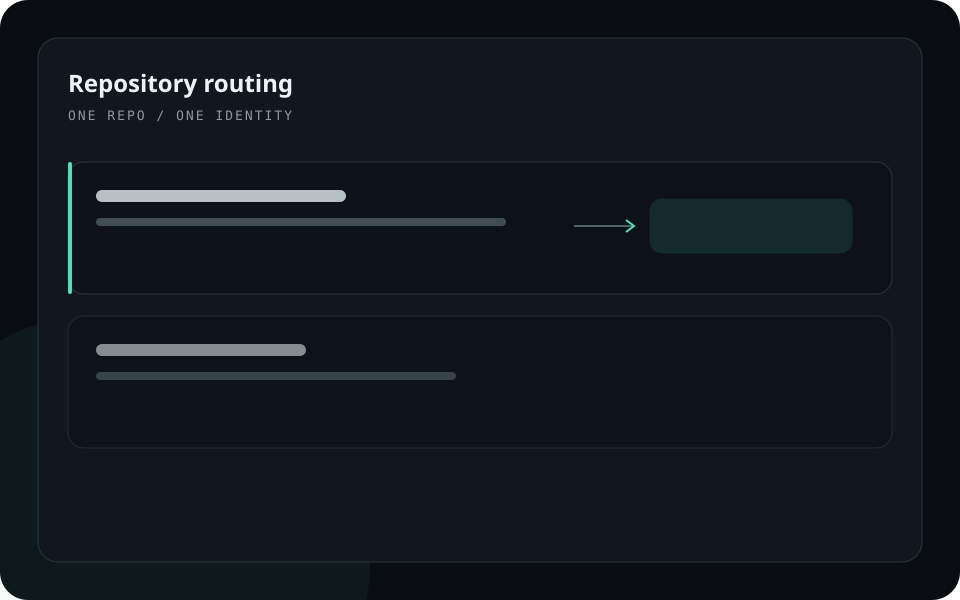
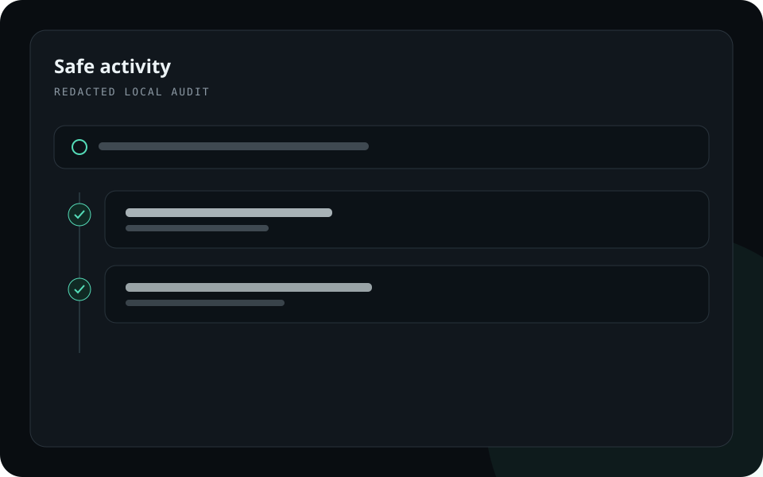

# Shehata Git

<p align="center">
  
</p>

<p align="center"><strong>One repo. One identity. Zero switching.</strong></p>

<p align="center">
  A local-first identity router for developers and coding agents that work with
  multiple GitHub accounts.
</p>

> [!IMPORTANT]
> Shehata Git is an early Windows preview. Use disposable repositories while
> evaluating it, review every assignment before confirming it, and keep normal
> backups of important work.

## Why Shehata Git?

Git separates commit authorship from remote authentication, while GitHub CLI
can hold more than one account for the same host. That flexibility is useful,
but it also makes it easy for a terminal or coding agent to push with the wrong
identity.

Shehata Git assigns one authenticated GitHub identity to each local repository.
The route is repository-scoped, works outside the desktop UI, and fails closed
when the assigned account is unavailable.

## Key features

- Discover accounts from the official GitHub CLI without importing passwords
  or persisting tokens.
- Assign an exact GitHub account and optional commit author to each repository.
- Route HTTPS credentials per repository through `git-credential-shehata`.
- Review changes, stage selected files, commit, pull with `--ff-only`, and run
  normal policy-checked pushes.
- Expose a bounded MCP server for Codex, Claude Code, Cursor, and other coding
  clients without exposing arbitrary shell execution.
- Record a redacted local activity trail that the user can search or clear.
- Diagnose Git, GitHub CLI, WebView2, PATH, helper, database, and MCP readiness.
- Restore the previous repository-local Git configuration when unlinking.

## Screenshots

Real, sanitized screenshots will replace these placeholders before the first
stable release.

| Identity control | Repository routing | Safe activity |
|---|---|---|
|  |  |  |

## Requirements

### To run the Windows preview

- Windows 10 or 11, x64
- [Git for Windows](https://git-scm.com/download/win)
- [GitHub CLI](https://cli.github.com/)
- Microsoft Edge WebView2 Runtime (normally already installed on supported
  Windows versions)
- One or more GitHub accounts authenticated through GitHub CLI

The System Check page can install missing Git and GitHub CLI packages through
Windows Package Manager after explicit confirmation.

### To build from source

- Node.js 20 or newer
- pnpm 9 or newer
- Stable Rust toolchain
- Platform prerequisites required by [Tauri 2](https://v2.tauri.app/start/prerequisites/)

On Windows, install the MSVC C++ Build Tools and a Windows SDK.

## Installation

There is no signed public binary yet. Until a reviewed release is published,
build from source:

```bash
git clone https://github.com/moshehata95/Shehata-Git.git
cd Shehata-Git
pnpm install --frozen-lockfile
pnpm prepare:sidecars
cargo build --workspace
pnpm dev
```

`prepare:sidecars` builds the CLI, credential helper, and MCP executable that
Tauri validates and bundles beside the desktop app.

Build the Windows NSIS installer with:

```bash
pnpm build
```

The installer is written to
`target/release/bundle/nsis/Shehata Git_<version>_x64-setup.exe`.

## Usage

1. Open **System Check** and resolve any missing prerequisites.
2. Open **Identities** and sign in through GitHub's browser flow.
3. Open **Repositories**, choose a local Git worktree, and review the detected
   remote.
4. Assign the intended GitHub identity and optional local commit author.
5. Confirm **Connect and verify**. Shehata Git backs up the relevant local Git
   configuration, enables the route, and performs a read-only remote test.
6. Use Git normally from the app, a terminal, or an approved coding agent.

`CLI default` in the Identities page means the account used by ordinary `gh`
commands for that host. Use **Make CLI default** to change it after an in-app
confirmation. It does **not** override repository routes.

### CLI examples

```bash
shehata doctor
shehata accounts list
shehata repos add "C:\path\to\repository"
shehata repos list
shehata repos assign "C:\path\to\repository" --account octocat
shehata status "C:\path\to\repository"
shehata test "C:\path\to\repository"
shehata push "C:\path\to\repository" --yes
```

Add `--json` before the subcommand for machine-readable output.

## Architecture

```text
React desktop UI ──Tauri IPC──▶ shehata-core ──▶ shehata-git
shehata CLI ──────────────────▶      │         ├─▶ shehata-github
shehata MCP server ───────────▶      │         └─▶ shehata-storage
Git credential protocol ──────▶ git-credential-shehata
```

Business rules live in Rust, not in React or Tauri handlers. SQLite stores
repository mappings, configuration backups, and redacted audit metadata—but no
credential values. See [Architecture](docs/ARCHITECTURE.md) and the
[decision records](docs/DECISIONS/).

## Security

- Tokens stay in the official GitHub CLI credential store and are requested
  just in time by the Rust backend.
- Tokens never cross Tauri IPC, enter SQLite, or appear in MCP responses.
- Processes launched by the app use fixed executables, argument arrays,
  timeouts, and validated inputs. Git's required `!` helper entry is generated
  only from a canonical executable path and validated UUID.
- Force push, destructive reset, clean, rebase, amend, remote deletion, and
  arbitrary shell execution are intentionally unavailable.
- Repository routing fails closed instead of falling through to another
  account.

Read the [security model](docs/SECURITY.md) and report vulnerabilities through
the process in [SECURITY.md](SECURITY.md). Never post credentials in an issue.

## Roadmap

The immediate focus is a trustworthy Windows beta: sanitized acceptance
screenshots, clean-machine CI, two-account acceptance testing, code signing,
and a reviewed installer. macOS packaging and notarization follow after the
Windows workflow is stable.

See the complete [roadmap](docs/ROADMAP.md).

## Contributing

Issues and focused pull requests are welcome. Start with
[CONTRIBUTING.md](CONTRIBUTING.md), follow the
[Code of Conduct](CODE_OF_CONDUCT.md), and use the provided issue/PR templates.

The required quality gate is:

```bash
cargo fmt --all -- --check
cargo clippy --workspace --all-targets -- -D warnings
cargo test --workspace
pnpm --filter @shehata/desktop lint
pnpm --filter @shehata/desktop typecheck
pnpm --filter @shehata/desktop test
```

## License

Shehata Git is available under the [MIT License](LICENSE).
